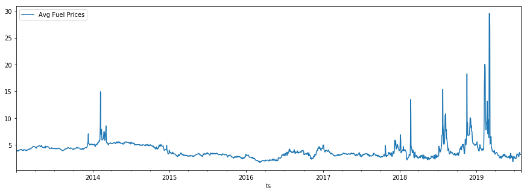
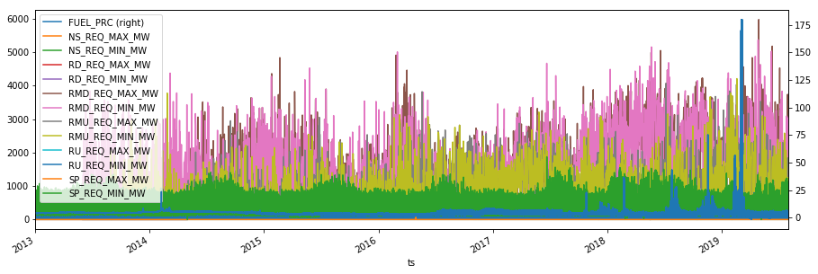

# Energy Dashboard (ED)

The _Energy Dashboard_, a part of the _Energy Analytics Project_, is a tool to
help de-carbonize the energy sector by providing easy access to publicly
available data. See [background](./docs/background.md) for further details.

## Examples

## Getting Started

* See the [HowToGuide](./docs/howto.mf) for instructions
* Join the [email list](https://groups.google.com/d/forum/energy-analytics-project) 

## License

[ED is GPL3.0](./LICENSE)
