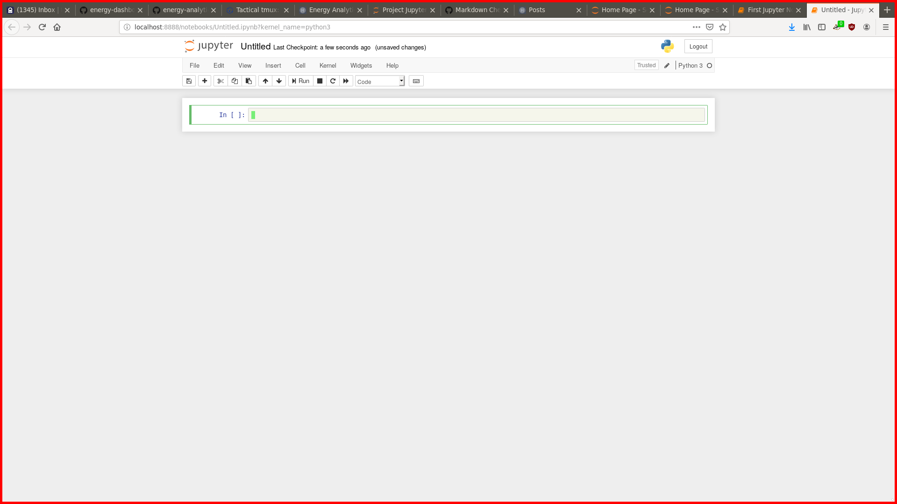

# How To Get Started


In each section below, I'll give an 'overview' that describes the section,
followed by an 'example' with detailed instructions for that section. The
'example' section will be based on GNU/Linux (Ubuntu distro). If you are
using a different operating system, use these sections as a guide not a 
recipe. (Pull Requests are welcome!)

## Prepare to Create a Jupyter Notebook

### Overview

#### Install Dependencies

This tutorial depends on the following tools: Conda/Anaconda, Sqlite3, Jupyter
notebooks, and any tool that can decompress 'gzip' files. Conda/Anaconda is a
great tool for managing python virtual environments. I started seriously using
it this summer and I haven't looked back. It makes working with python virtual
environments a breeze. Sqlite3 needs to be installed in order to access the
databases. Jupyter Notebooks is installed into the Conda/python3 virtual
environment (instructions below). Pigz is really a nice-to-have. You can use
any tooling you like that supports decompressing gzip files.

For reference, here are links to the install or home page for each tool:

* [conda](https://www.anaconda.com/distribution/#download-section)
* [sqlite3](https://sqlite.org/index.html)
* [jupyter](https://jupyter.readthedocs.io/en/latest/install.html)
* [more jupyter](https://jupyter.org/install)
* [pigz](https://zlib.net/pigz/)

####  Create a Conda environment

When I get confused about Conda, I go back to this tutorial for a refresher:

* [Conda tutorial](https://geohackweek.github.io/Introductory/01-conda-tutorial/)

### Example

Detailed installation instructions here for Ubuntu. See the links above for
instructions specific to your operating system.

#### Install Dependencies

##### Conda

This is cribbed straight from the Conda page:

```bash
wget https://repo.anaconda.com/archive/Anaconda3-2019.07-Linux-x86_64.sh
chmod +x Anaconda3-2019.07-Linux-x86_64.sh 
./Anaconda3-2019.07-Linux-x86_64.sh 
```

##### Sqlite3 and Pigz and tex

Note: Pigz isn't necessary, you can always use gzip/gunzip... but Pigz uses
all your cores, so why not?

Texlive is for xelatex, which is used to generate pdf's of reports.

```bash
sudo apt install sqlite3 pigz texlive-xetex
```

#### Environment

Create a Conda environment, it can be named anything, I'll call this
`energy-dashboard`. We'll create the environment with Jupyter and other goodies
already installed... Note that if you find during the course of experimentation
that you need something else, then you can always `pip install -U {{name of
tool here}}` from within the Conda environment.

```bash
conda update conda
conda create -n energy-dashboard python=3 numpy jupyter pandas pandasql matplotlib
conda activate energy-dashboard
```

OK, we are ready to play with data!

## Play With Data!

### Overview

#### Download Data
* Select one or more of the available databases below
* Click the links with your browser, or use curl, or wget, whatever.

#### Decompress the Database
* Decompress the dataset locally on your machine
* Use any tooling that can decompress gzip files (gzip, pigz, etc.)

#### Verify the database
* Use Sqlite3 from the console to run some queries on the database
* Noodle around a bit to get a feel for what you have and how the database is
  structured

Here's the template for the commands we'll be using below. Note that I'm using
mustache template style variables here. This is just for stylistic clarity, the
examples below will be copy-and-pastable...

```bash
sqlite3 {{DBNAME}} ".tables"
sqlite3 {{DBNAME}} "PRAGMA table_info({{TABLE_NAME}})"
sqlite3 {{DBNAME}} "select count(*) from {{TABLE_NAME}}"
sqlite3 {{DBNAME}} "select * from {{TABLE_NAME}} LIMIT 10"
```

### Example

You can literally copy-and-paste the bash stanzas into a shell. No need to type
all this out again.

#### Download Data

This is a small file, so rate limiting is probably not necessary. Still, it's
better to be kind to the servers...

```bash
curl --limit-rate 10M https://s3.us-west-1.wasabisys.com/eap/energy-dashboard/data/data-oasis-ene-wind-solar-summary/db/data-oasis-ene-wind-solar-summary_00.db.gz -o data-oasis-ene-wind-solar-summary_00.db.gz
```

#### Decompress the Database(s)

Experience the full glory of a multi-core decompressor. Except that this is
such a tiny file it will probably decompress instantly. But when you try this
on one of the larger datasets, fire up `htop` and revel in the spectacle of it
all...

```bash
pigz -d data-oasis-ene-wind-solar-summary_00.db.gz
```

Or go old-school and either use `gzip -d` or it's alias, `gunzip`:

```bash
gunzip data-oasis-ene-wind-solar-summary_00.db.gz
```

#### Verify the database

Here's where the rubber meets the road. Theoretically, we have downloaded a
compressed database, decompressed it, and it has data we can use. In theory. So
let's vet the database before going any further...

##### What tables does this report have?

```bash
sqlite3 data-oasis-ene-wind-solar-summary_00.db ".tables"

disclaimer_item  messagepayload   report_header
error            oasisreport      report_item
messageheader    report_data      rto
```

Now that seems reasonable. In fact, all of the CAISO OASIS reports, which are
in XML, have a similar structure (though not identical). The parser examines
the XML structure, and creates a normalized schema for the data and then
inserts the data into the database. One side-effect of how this pipeline is
implemented is this: table relationships are mapped using UUIDS rather than
Sqlite3 ROW IDS. This is a common practice in large databases that need to be
sharded, etc., and it's just as valid for small datasets like these.

##### What does each table look like?

```bash
sqlite3 data-oasis-ene-wind-solar-summary_00.db "PRAGMA table_info(report_item)"

0|id|TEXT|0||1
1|rto_name|TEXT|0||0
```

```bash
sqlite3 data-oasis-ene-wind-solar-summary_00.db "PRAGMA table_info(report_data)"

0|data_item|TEXT|0||1
1|interval_end_gmt|TEXT|0||2
2|interval_start_gmt|TEXT|0||3
3|value|INTEGER|0||4
4|opr_date|TEXT|0||5
5|report_item_id|TEXT|0||0
```

```bash
sqlite3 data-oasis-ene-wind-solar-summary_00.db "PRAGMA table_info(report_header)"

0|report|TEXT|0||1
1|system|TEXT|0||2
2|sec_per_interval|INTEGER|0||3
3|uom|TEXT|0||4
4|interval|TEXT|0||5
5|tz|TEXT|0||6
6|mkt_type|TEXT|0||7
7|report_item_id|TEXT|0||0
```

##### What does some sample data look like?

```bash
sqlite3 data-oasis-ene-wind-solar-summary_00.db "select * from report_item limit 2"

45a7b62a-987b-4ac7-a131-29aab2850b0e|CAISO
8e47de63-00e1-446e-8586-825c6b6f001a|CAISO
```

```bash
sqlite3 data-oasis-ene-wind-solar-summary_00.db "select * from report_data limit 2"

DAM_FORECAST|2016-10-17T11:00:00-00:00|2016-10-17T10:00:00-00:00|2556|2016-10-17|45a7b62a-987b-4ac7-a131-29aab2850b0e
DAM_FORECAST|2016-10-17T22:00:00-00:00|2016-10-17T21:00:00-00:00|9409|2016-10-17|45a7b62a-987b-4ac7-a131-29aab2850b0e
```

```bash
sqlite3 data-oasis-ene-wind-solar-summary_00.db "select * from report_header limit 2"

ENE_WIND_SOLAR_SUMMARY|OASIS|3600|MW|ENDING|PPT|DAM|45a7b62a-987b-4ac7-a131-29aab2850b0e
ENE_WIND_SOLAR_SUMMARY|OASIS|300|MW|ENDING|PPT|RTD|61665051-e88b-4971-a3a5-6915bd2993e1
```

As mentioned above, the tables are joined by UUIDs. Both report_header and
report_data are joined to their 'parent' table, report_item, by
'report_item_id'.

##### How were the tables created?

If you want to see all the DDL for creating the tables, this will do it:

```bash
sqlite3 data-oasis-ene-wind-solar-summary_00.db ".dump" | grep CREATE

CREATE TABLE oasisreport (id TEXT, PRIMARY KEY (id));
CREATE TABLE messageheader (source TEXT, version TEXT, timedate TEXT, oasisreport_id TEXT, FOREIGN KEY (oasisreport_id) REFERENCES oasisreport(id), PRIMARY KEY (source, version, timedate));
CREATE TABLE messagepayload (id TEXT, oasisreport_id TEXT, FOREIGN KEY (oasisreport_id) REFERENCES oasisreport(id), PRIMARY KEY (id));
CREATE TABLE rto (name TEXT, messagepayload_id TEXT, FOREIGN KEY (messagepayload_id) REFERENCES messagepayload(id), PRIMARY KEY (name));
CREATE TABLE report_item (id TEXT, rto_name TEXT, FOREIGN KEY (rto_name) REFERENCES rto(name), PRIMARY KEY (id));
CREATE TABLE report_header (report TEXT, system TEXT, sec_per_interval INTEGER, uom TEXT, interval TEXT, tz TEXT, mkt_type TEXT, report_item_id TEXT, FOREIGN KEY (report_item_id) REFERENCES report_item(id), PRIMARY KEY (report, system, sec_per_interval, uom, interval, tz, mkt_type));
CREATE TABLE report_data (data_item TEXT, interval_end_gmt TEXT, interval_start_gmt TEXT, value INTEGER, opr_date TEXT, report_item_id TEXT, FOREIGN KEY (report_item_id) REFERENCES report_item(id), PRIMARY KEY (data_item, interval_end_gmt, interval_start_gmt, value, opr_date));
CREATE TABLE disclaimer_item (disclaimer TEXT, rto_name TEXT, FOREIGN KEY (rto_name) REFERENCES rto(name), PRIMARY KEY (disclaimer));
CREATE TABLE error (err_code INTEGER, err_desc TEXT, rto_name TEXT, FOREIGN KEY (rto_name) REFERENCES rto(name), PRIMARY KEY (err_code, err_desc));
```

## Create a Jupyter Notebook

### Overview

There are lots of great tutorials out on the web for creating Jupyter
Notebooks. So I'll keep this super simple and try to highlight just 
the basics of connecting to the database and displaying data.

#### Basic Steps

* launch Conda environment
* launch Jupyter notebook
* create a new notebook
* verify database
* display data
* display graphs

### Example

Warning, screenshots galore to follow...

#### Launch Conda environment

You probably already have this launched, but if not, launch it:

```bash
conda activate energy-dashboard
```

#### Create Notebook

Since we installed `jupyter` into our Conda environment, it's available
at the console:

```bash
jupyter-notebook 
```

And here's the jupyter-notebook server starting up:

```bash
[I 17:49:14.356 NotebookApp] Writing notebook server cookie secret to /home/toddg/.local/share/jupyter/runtime/notebook_cookie_secret
[I 17:49:15.032 NotebookApp] Serving notebooks from local directory: /mnt/c/proj/energy-dashboard
[I 17:49:15.032 NotebookApp] The Jupyter Notebook is running at:
[I 17:49:15.032 NotebookApp] http://localhost:8888/?token=11130dc41cf890ba862414308e4045f0446b3e0d7d1458f9
[I 17:49:15.032 NotebookApp]  or http://127.0.0.1:8888/?token=11130dc41cf890ba862414308e4045f0446b3e0d7d1458f9
[I 17:49:15.032 NotebookApp] Use Control-C to stop this server and shut down all kernels (twice to skip confirmation).
[W 17:49:15.045 NotebookApp] No web browser found: could not locate runnable browser.
[C 17:49:15.046 NotebookApp] 
    
    To access the notebook, open this file in a browser:
        file:///home/toddg/.local/share/jupyter/runtime/nbserver-16997-open.html
    Or copy and paste one of these URLs:
        http://localhost:8888/?token=11130dc41cf890ba862414308e4045f0446b3e0d7d1458f9
     or http://127.0.0.1:8888/?token=11130dc41cf890ba862414308e4045f0446b3e0d7d1458f9
```

So paste this link into your browser:

        file:///home/toddg/.local/share/jupyter/runtime/nbserver-16997-open.html

Note: your link will (obviously) be different. Copy the link that _your_ server showed when it started.

#### Browser

Your browser should have opened up the navigation pane in Jupyter notebooks and
it should look a lot like this:


#### Create a new Notebook (using Python3)

Now click on the button to create a new notebook and you should have a new
notebook that looks a lot like this:




#### Connect to Database

Assuming you started up `jupyter` from the _same directory_ as where you
downloaded the database, 'data-oasis-ene-wind-solar-summary_00.db', then 
this is what you'd enter into the first cell:

```python3
import sqlite3
import pandas as pd
import matplotlib.pyplot as plt
from pandasql import sqldf
# Create the connection
cnx  = sqlite3.connect(r'data-oasis-ene-wind-solar-summary_00.db')
```

If your database is someplace else, then enter in either the relative path or the
fully qualified path to the notebook in that last line:

Example with mustache template for clarity:

```python3
cnx  = sqlite3.connect(r'{{FULL OR RELATIVE PATH TO YOUR DATABASE}}')
```

Example with relative path:

```python3
cnx  = sqlite3.connect(r'./example/of/a/relative/path/to/my/dababase/data-oasis-ene-wind-solar-summary_00.db')
```

Example with fully qualified path:

```python3
cnx  = sqlite3.connect(r'/user/doctorwho/example/of/a/fully/qualified/path/to/my/dababase/data-oasis-ene-wind-solar-summary_00.db')
```


#### Verify Database

Enter each of the following stanzas into a cell and verify the outputs match by
*running* or *executing* the cell(s). On my system, I can press
CTRL-SHIFT-ENTER to run all the cells in a notebook. Check your install to see
what's available for you. Note that I have installed an
[extension](https://github.com/lambdalisue/jupyter-vim-binding) to make editing
cells less painful. I have tried IntelliJ's jupyter notebook support and it
looks really cool, but had enough glitches that I stopped using it (for now).
YMMV.


##### Verify the tables

```python3
for row in cnx.execute("PRAGMA table_info([report_item]);"):
    print(row)
```

```python3
for row in cnx.execute("PRAGMA table_info([report_data]);"):
    print(row)
```

```python3
for row in cnx.execute("PRAGMA table_info([report_header]);"):
    print(row)
```

Here's what that should look like:


##### Verify the data

Now verify that the data looks similar...

```python3
for row in cnx.execute("select * from report_item LIMIT 2;"):
    print(row)
```
```python3
for row in cnx.execute("select * from report_data LIMIT 2;"):
    print(row)
```
```python3
for row in cnx.execute("select * from report_data LIMIT 2;"):
    print(row)
```


#### Display Data

Load a dataframe. Note that I'm not using the SQL 'limit' here, instead I'm using
python to slice the first few rows from the dataframe:

```python3
df = pd.read_sql("select report_data.data_item, report_data.value, report_header.uom, report_header.report, report_header.mkt_type, report_data.interval_start_gmt, report_data.interval_end_gmt from report_header inner join report_data on report_header.report_item_id = report_data.report_item_id;", cnx)
df[0:5]
```


#### Make Charts

```python3
for title, group in df.groupby(['report']):
    group.plot.line(x='interval_start_gmt', y='value', title=title)
```

```python3
for title, group in df.groupby(['data_item']):
    group.plot.line(x='interval_start_gmt', y='value', title=title)
```


This example can be found [here](../notebooks/first-notebook-for-energy-dashboard.ipynb).

## Share

### Attribution

* Please include attribution in your notebook(s) telling where you sourced the
  data from.
* Please send me a link to your notebook(s) and report PDFs so that we can
  include it in the list of reports generated from this project.

### Notebooks

While it is true that some services such as github.com can live render jupyter
notebooks directly from a Sqlite3 database (cool, right!), it's not something
that I suggest. The service can fail to render at any time, leaving your
customers with no idea what your report would look like. By all means, share
the jupyter notebooks everywhere, but also include a PDF of the rendered report
so that if something breaks, or someone you want to share with doesn't have the
tooling installed, they can still benefit from your research. I'm saying this
from experience. The first time I wanted to show someone how cool all this is
(you can actually connect up _multiple_ sqlite3 databases, each in a git
submodule, and join them all into a single panda dataframe, all rendered 'live'
by github.com), either their website, their corporate firewall, or github.com...
something failed. It wasn't my fault, but I looked bad. 

I didn't have time to diagnose the issue at the time. And when I got back home,
everything worked again. But that was from my machine, using my browser, on my
internet connection, etc. 

*Lesson learned: have a backup plan -> export your notebooks to PDF for distribution.*

Here are some example pdf's:

* [oasis-as-req-dam](../notebooks/oasis-as-req-dam.pdf).
* [oasis-as-req-dam-and-fuel-prc](../notebooks/oasis-as-req-dam-and-fuel-prc.pdf).

### Data

As far as sharing your research... I'd share the notebook(s) and the
database(s). You will want to have your database checked into some kind of
repository or file system... definitely do not rely on the S3 buckets that I'm
exposing for anything but periodic updates. Like any service, I cannot
guarantee their availability over time. That is to say, there is no SLA here.
I have a pipeline in place to periodically pull down daily reports from the
data sources (currently CAISO OASIS). I'm not sure of the frequency that I'll
be updating the databases replicated to the S3 buckets. That depends on how
well the pipeline works as well as how well the availability of the data
sources and the S3 services. There are a lot of moving parts here. 

*Summary: Manage and share your own data as appropriate for your project.*

## Further reading

### Sample Notebooks

* [oasis-as-req-dam](../notebooks/oasis-as-req-dam.ipynb)
* [oasis-as-req-dam-and-fuel-prc](../notebooks/oasis-as-req-dam-and-fuel-prc.ipynb)

## Science!

Go forth and do good work!

## Datasets

* [Full list of available datasets here](./datasets.md)

## Tooling

For anyone that wants to understand the data pipeline, it's architecture and command line tooling...go here:

* [energy-dashboard-cli](https://github.com/energy-analytics-project/energy-dashboard-cli)
* [energy-dashboard-lib](https://github.com/energy-analytics-project/energy-dashboard-lib)
